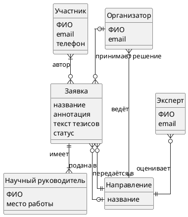
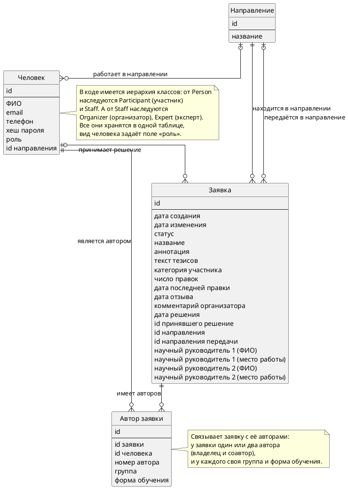

# ER-диаграммы

## На концептуальном уровне:

```plantuml
@startuml
hide circle
skinparam linetype ortho

entity "Участник" as participant {
  ФИО
  email
  телефон
}

entity "Организатор" as organizer {
  ФИО
  email
}

entity "Эксперт" as expert {
  ФИО
  email
}

entity "Заявка" as application {
  название
  аннотация
  текст тезисов
  статус
}

entity "Научный руководитель" as supervisor {
  ФИО
  место работы
}

entity "Направление" as direction {
  название
}

participant }|--o{ application : автор
application }o--|| direction : подана в
application }o--o| direction : передаётся в
application ||--|{ supervisor : имеет
organizer |o--o{ application : принимает решение
organizer }o--|| direction : ведёт
expert }o--|| direction : оценивает
@enduml
```

## Физическая модель

```plantuml
@startuml
hide circle
skinparam linetype ortho

entity "Направление" as direction {
  id
  --
  название
}

entity "Человек" as person {
  id
  --
  ФИО
  email
  телефон
  хеш пароля
  роль
  id направления
}

entity "Заявка" as application {
  id
  --
  дата создания
  дата изменения
  статус
  название
  аннотация
  текст тезисов
  категория участника
  число правок
  дата последней правки
  дата отзыва
  комментарий организатора
  дата решения
  id принявшего решение
  id направления
  id направления передачи
  научный руководитель 1 (ФИО)
  научный руководитель 1 (место работы)
  научный руководитель 2 (ФИО)
  научный руководитель 2 (место работы)
}

entity "Автор заявки" as author {
  id
  --
  id заявки
  id человека
  номер автора
  группа
  форма обучения
}

note right of author
  Связывает заявку с её авторами: 
  у заявки один или два автора
  (владелец и соавтор), 
  и у каждого своя группа и форма обучения.
end note

note left of person
  В коде имеется иерархия классов: от Person
  наследуются Participant (участник)
  и Staff. А от Staff наследуются 
  Organizer (организатор), Expert (эксперт).
  Все они хранятся в одной таблице,
  вид человека задаёт поле «роль».
end note

direction ||--o{ application : находится в направлении
direction |o--o{ application : передаётся в направление
direction |o--o{ person : работает в направлении
person |o--o{ application : принимает решение
application ||--o{ author : имеет авторов
person ||--o{ author : является автором
@enduml
```
